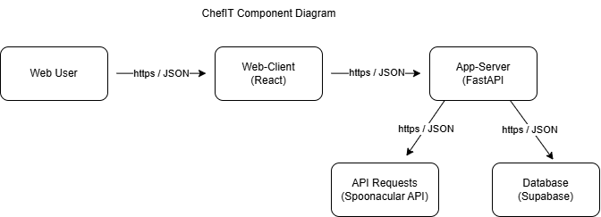
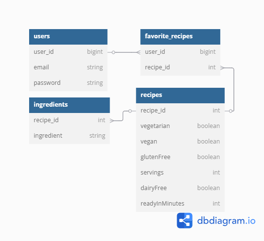
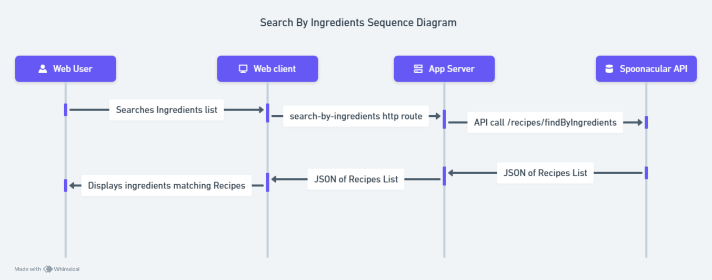

# ChefIT Architecture

This is the system infrastructure diagram of ChefIT. Frontend is a React single‑page application that runs in the user’s browser and, over the HTTPS protocol, exchanges JSON payloads with a Python FastAPI backend that exposes REST endpoints. Whenever a user searches for recipes, FastAPI fans out to the external Spoonacular API also via HTTPS to retrieve recipe data. Supabase (postgres) is used for storing user profiles and each user's list of favorite recipes.

This is Entity Relation Diagram of ChefIT. `Users` table stores the apps users, mainly an assigned user_id, email (String), password(hashed string). `favorite_recipes` table is linked to Users table through `user_id` storing recipe_id for each user. `recpies` table is linked with `favorite_recipes` through `recipe_id` storing info with attributes such as vegetarian, vegan, glutenFree, dairyFree, servings and readyInMinutes. Because `favorite_recipes` points back to both parent tables, one user can save many recipes and one recipe can be saved by many users—together forming the expected many‑to‑many relationship between users and recipes. each recipe can have many ingredient rows (one‑to‑many) which holds its different ingredients.

This is search by ingredients feature sequence diagram of ChefIT. This feature allows users to search recipes based on different ingredients. When a ChefIT user submits an ingredient list in the browser, the React web client sends an HTTPS GET request to the FastAPI backend via the search‑by‑ingredients route, passing the ingredients as query parameters. The backend translates that request into a call to Spoonacular’s GET /recipes/findByIngredients endpoint. Spoonacular returns a JSON array of matching recipes, which the FastAPI server then forwards to the web client. Finally, the client renders the recieved data, presenting users with the list of recipes that match their provided ingredients